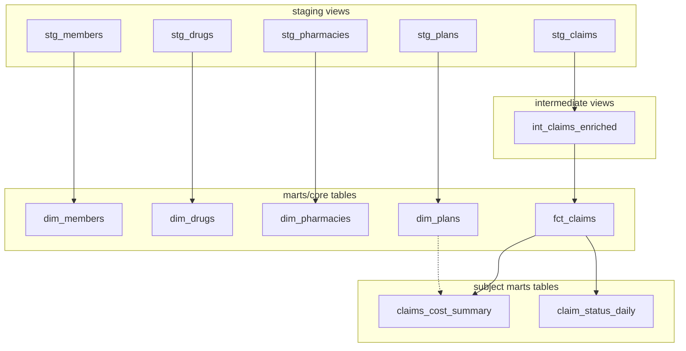

# Add core, finance, and operations marts

## Target architecture



All mart models inherit from [dbt_project.yml](dbt_project.yml): `+schema: marts`, `+materialized: table`. No schema macro exists today, so `core/`, `finance/`, and `operations/` are organizational folders only (tables land in one `marts` schema). Optional follow-up: nest `+schema: core|finance|operations` under each subfolder in `dbt_project.yml` if you want separate Snowflake schemas later.

---

## 1. Core mart models (`models/marts/core/`)

### Dimensions (thin publish layer on staging)

One SQL file per entity, `select` from the matching `stg_*` model. Reuse staging column sets and descriptions; no new business logic.

| Model | Source | Primary key |
|-------|--------|-------------|
| `dim_members.sql` | [`stg_members`](models/staging/members/stg_members.sql) | `member_id` |
| `dim_drugs.sql` | [`stg_drugs`](models/staging/drugs/stg_drugs.sql) | `drug_id` |
| `dim_pharmacies.sql` | [`stg_pharmacies`](models/staging/pharmacies/stg_pharmacies.sql) | `pharmacy_id` |
| `dim_plans.sql` | [`stg_plans`](models/staging/plans/stg_plans.sql) | `plan_id` |

Skip `dim_providers` for now — claims have no `provider_id` FK.

### Fact (`fct_claims.sql`)

- **Source:** [`int_claims_enriched`](models/intermediate/claims/int_claims_enriched.sql)
- **Grain:** one row per `claim_id` (already enforced in intermediate)
- **Explicit column list** — do not `select *`; exclude `row_num` (currently leaked by intermediate `select *` from deduped ranked rows)
- **Include** all claim attributes plus enrichments: `gross_claim_cost`, `pct_total_member_copay`, `is_claim_paid`
- **Optional derived column** (matches roadmap Phase 5): `allowed_amount = member_copay + plan_paid` — useful for finance mart and paid-claim tests

```sql
-- pattern (not full file)
select
    claim_id,
    member_id,
    drug_id,
    pharmacy_id,
    plan_id,
    ndc_code,
    claim_status,
    fill_date,
    days_supply,
    quantity,
    ingredient_cost,
    dispensing_fee,
    member_copay,
    plan_paid,
    member_copay + plan_paid as allowed_amount,
    gross_claim_cost,
    pct_total_member_copay,
    is_claim_paid,
    loaded_at
from {{ ref('int_claims_enriched') }}
```

---

## 2. Finance mart (`models/marts/finance/`)

### `claims_cost_summary.sql`

- **Grain:** one row per `fill_month` + `plan_id`
- **Source:** `fct_claims` (left join `dim_plans` optional for `plan_name` / `plan_type` in the mart — keeps finance self-contained for BI)
- **Metrics** (aligned with [ROADMAP.md](ROADMAP.md) Phase 6):

| Column | Logic |
|--------|--------|
| `fill_month` | `date_trunc('month', fill_date)` |
| `plan_id` | group key |
| `total_claims` | `count(*)` |
| `paid_claims` | `sum(is_claim_paid)` |
| `rejected_claims` | `count` where `claim_status = 'rejected'` |
| `reversed_claims` | `count` where `claim_status = 'reversed'` |
| `total_gross_claim_cost` | `sum(gross_claim_cost)` |
| `total_ingredient_cost` | `sum(ingredient_cost)` |
| `total_dispensing_fee` | `sum(dispensing_fee)` |
| `total_member_copay` | `sum(member_copay)` |
| `total_plan_paid` | `sum(plan_paid)` |
| `avg_gross_claim_cost` | `avg(gross_claim_cost)` where `is_claim_paid = 1` (or null-safe variant) |

---

## 3. Operations mart (`models/marts/operations/`)

### `claim_status_daily.sql`

- **Grain:** one row per `fill_date`
- **Source:** `fct_claims`
- **Metrics:**

| Column | Logic |
|--------|--------|
| `fill_date` | group key |
| `total_claims` | `count(*)` |
| `paid_claims` | `sum(is_claim_paid)` |
| `rejected_claims` | status = `rejected` |
| `reversed_claims` | status = `reversed` |
| `paid_claim_rate` | `paid_claims / nullif(total_claims, 0)` |
| `reversal_rate` | `reversed_claims / nullif(total_claims, 0)` |

---

## 4. YAML schema files (generic tests)

Follow existing conventions from [`_stg_claims.yml`](models/staging/claims/_stg_claims.yml) and [`_int_claims_enriched.yml`](models/intermediate/claims/_int_claims_enriched.yml): `arguments:` block for `accepted_values`, model-level descriptions.

| File | Models covered |
|------|----------------|
| `_core__models.yml` | all 5 core models (or split `_fct_claims.yml` + `_dims__models.yml` if you prefer smaller files — one combined file is fine for this repo size) |
| `_finance__models.yml` | `claims_cost_summary` |
| `_operations__models.yml` | `claim_status_daily` |

### Core tests

**Dimensions** (each PK column):
- `unique`, `not_null`
- Re-apply `accepted_values` where staging already has them (`member_status`, `brand_generic`, `network_status`, `plan_type`, etc.)

**`fct_claims`:**
- `claim_id`: `unique`, `not_null`
- FK columns: `relationships` to dims (first time in project — roadmap Phase 7 checkbox):

```yaml
- name: member_id
  data_tests:
    - not_null
    - relationships:
        arguments:
          to: ref('dim_members')
          field: member_id
# repeat for drug_id, pharmacy_id, plan_id
```

- Reuse staging/intermediate tests on `claim_status`, `is_claim_paid`, amount `not_null` columns, `gross_claim_cost` `not_null`

**Subject marts:**
- `claims_cost_summary`: `not_null` on `fill_month`, `plan_id`; **composite uniqueness** via `dbt_utils.unique_combination_of_columns` only if you add `dbt_utils` package — otherwise use a **singular test** in `tests/` (see below)
- `claim_status_daily`: `fill_date` `unique`, `not_null`; `total_claims` `not_null`

---

## 5. Singular tests (`tests/`)

Mirror the pattern in [`tests/intermediate/claims/int_claims_enriched_gross_claim_cost_positive.sql`](tests/intermediate/claims/int_claims_enriched_gross_claim_cost_positive.sql): query returns failing rows; empty = pass.

### On `fct_claims` (`tests/marts/core/`)

| Test file | Rule (matches synthetic generator in [`generate_synthetic_claims.py`](scripts/generate_synthetic_claims.py) / [`common.py`](scripts/synthetic/common.py)) |
|-----------|--------|
| `fct_claims_rejected_zero_payments.sql` | `claim_status = 'rejected'` implies `plan_paid = 0` and `member_copay = 0` |
| `fct_claims_paid_positive_allowed_amount.sql` | `is_claim_paid = 1` implies `allowed_amount > 0` (or `plan_paid + member_copay > 0`) |
| `fct_claims_non_negative_amounts.sql` | `ingredient_cost`, `dispensing_fee`, `member_copay`, `plan_paid`, `gross_claim_cost` all `>= 0` |
| `fct_claims_fill_date_not_future.sql` | `fill_date <= current_date()` |
| `fct_claims_days_supply_valid.sql` | `days_supply in (30, 60, 90)` |
| `fct_claims_gross_claim_cost_positive.sql` | `gross_claim_cost >= 0` (can supersede or duplicate intermediate test — prefer testing at mart contract level) |

### On subject marts (`tests/marts/finance/`, `tests/marts/operations/`)

| Test file | Rule |
|-----------|------|
| `claims_cost_summary_unique_grain.sql` | duplicate `(fill_month, plan_id)` pairs |
| `claim_status_daily_unique_fill_date.sql` | duplicate `fill_date` |
| `claim_status_daily_rates_bounded.sql` | `paid_claim_rate` and `reversal_rate` between 0 and 1 when not null |

---

## 6. Verification commands

After implementation:

```bash
dbt run --select marts
dbt test --select marts
dbt build --select marts   # run + test in one pass
```

Expect relationship tests to pass because synthetic data validates member/plan/drug/pharmacy integrity at generation time.

---

## 7. Files to create (summary)

**SQL (8):**
- `models/marts/core/fct_claims.sql`
- `models/marts/core/dim_members.sql`, `dim_drugs.sql`, `dim_pharmacies.sql`, `dim_plans.sql`
- `models/marts/finance/claims_cost_summary.sql`
- `models/marts/operations/claim_status_daily.sql`

**YAML (3):**
- `models/marts/core/_core__models.yml`
- `models/marts/finance/_finance__models.yml`
- `models/marts/operations/_operations__models.yml`

**Singular tests (9):**
- 6 under `tests/marts/core/`
- 1 under `tests/marts/finance/`
- 2 under `tests/marts/operations/`

**No changes required** to staging/intermediate SQL unless you optionally clean `row_num` out of `int_claims_enriched` later; `fct_claims` explicit select is sufficient for the mart layer.
