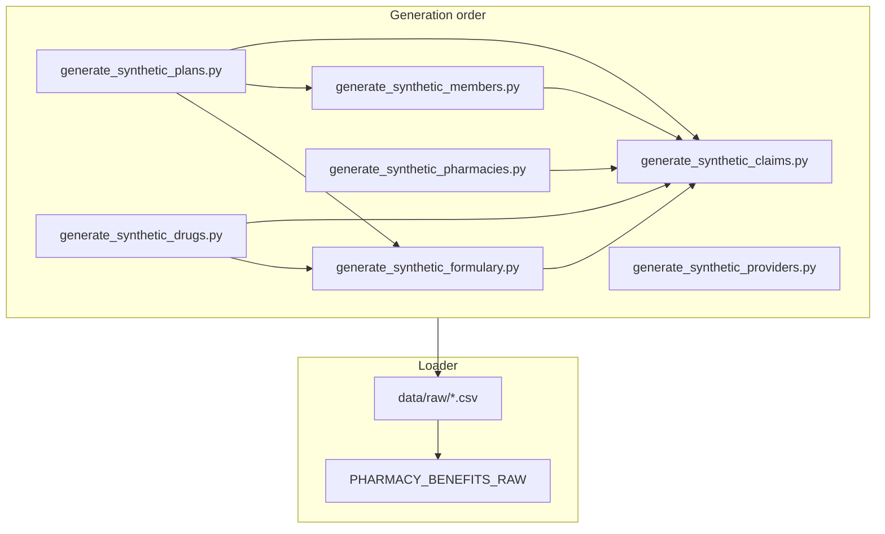

# Synthetic Raw Data Generators Plan

## Current State

[`scripts/generate_synthetic_claims.py`](scripts/generate_synthetic_claims.py) generates 100 claims with hard-coded ID ranges (`member_id` 1–50, `drug_id` 1–25, `pharmacy_id` 1–10, `plan_id` 1–5) but **no corresponding dimension CSVs exist**. This guarantees orphaned foreign keys and two other integrity gaps:

- `ndc_code` is chosen independently of `drug_id` (a claim can reference drug 21 with an NDC that belongs to a different drug)
- Financial fields ignore `claim_status` (rejected/reversed claims can still have large `plan_paid` values)

[`scripts/load_raw_to_snowflake.py`](scripts/load_raw_to_snowflake.py) loads only `claims.csv` into `PHARMACY_BENEFITS_RAW.CLAIMS.RAW_CLAIMS`. [`snowflake/setup_raw.sql`](snowflake/setup_raw.sql) already defines schemas for all domains: `CLAIMS`, `MEMBERS`, `PHARMACIES`, `DRUGS`, `PLANS`, `PROVIDERS`, `REFERENCE`.

[`scripts/run_pipeline.sh`](scripts/run_pipeline.sh) runs claims generation → load → dbt.



---

## Design Principles

1. **Single source of truth for counts and catalogs** — one shared module so dimension row counts always match claims FK ranges.
2. **Generate dimensions before facts** — claims script reads dimension CSVs and never invents IDs outside those files.
3. **Synthetic, non-PII data** — use patterns like `Member_001`, fake NPIs/NCPDP IDs, no realistic SSN/DOB/name combos (per [ROADMAP.md](ROADMAP.md) Phase 13).
4. **Reproducible runs** — fixed random seed (e.g. `seed(42)`) across all scripts.
5. **Dev-friendly reloads** — truncate raw tables before each load so re-running the pipeline does not duplicate rows (current `write_pandas` append behavior would stack data on every run).

---

## Shared Module: `scripts/synthetic/`

Create a small package (not over-abstracted) with two files:

### [`scripts/synthetic/constants.py`](scripts/synthetic/constants.py)

Central config aligned to existing claims assumptions:

| Entity | Count | Notes |
|--------|-------|-------|
| plans | 5 | IDs 1–5 |
| drugs | 25 | IDs 1–25, each with a unique `ndc_code` |
| pharmacies | 10 | IDs 1–10 |
| members | 50 | IDs 1–50, each assigned exactly one `plan_id` |
| providers | 15 | IDs 1–15 (not referenced by claims yet; supports future prescriber joins) |
| claims | 100 | unchanged volume |

Also define curated lookup lists: US states, plan types, therapeutic classes, pharmacy network statuses, claim statuses, specialties.

Expand the current 5 NDC codes into a 25-drug catalog (reuse the existing 5, generate 20 more in valid `#####-####-##` format) with paired `drug_name` / `therapeutic_class` / `brand_generic`.

### [`scripts/synthetic/common.py`](scripts/synthetic/common.py)

Extract duplicated boilerplate from the existing claims script:

- `OUT_DIR = Path("data/raw")`, `LOG_DIR`, logger setup
- `now = datetime.now(timezone.utc)` shared timestamp for a pipeline run
- `write_csv(df, filename)` helper
- `read_required_csv(filename)` for claims generator (fail fast if dimensions missing)

Each generator script stays ~60–90 lines; only claims needs cross-table logic.

---

## New Generator Scripts (one per raw table)

Each script follows the same pattern as [`generate_synthetic_claims.py`](scripts/generate_synthetic_claims.py): try/except with logging, write to `data/raw/<entity>.csv`, print row count.

### 1. [`scripts/generate_synthetic_plans.py`](scripts/generate_synthetic_plans.py)

**Output:** `data/raw/plans.csv` → `PHARMACY_BENEFITS_RAW.PLANS.RAW_PLANS`

| Column | Type | Notes |
|--------|------|-------|
| plan_id | int | PK, 1..5 |
| plan_name | str | e.g. `Gold PPO`, `Silver HMO` |
| plan_type | str | `commercial`, `medicare`, `medicaid`, `hmo`, `ppo` |
| loaded_at | timestamp | shared pipeline timestamp |

### 2. [`scripts/generate_synthetic_drugs.py`](scripts/generate_synthetic_drugs.py)

**Output:** `data/raw/drugs.csv` → `PHARMACY_BENEFITS_RAW.DRUGS.RAW_DRUGS`

| Column | Type | Notes |
|--------|------|-------|
| drug_id | int | PK, 1..25 |
| ndc_code | str | unique; sourced from constants catalog |
| drug_name | str | e.g. `Lisinopril 10mg Tablet` |
| therapeutic_class | str | e.g. `ACE Inhibitor`, `Statin` |
| brand_generic | str | `brand` or `generic` |
| loaded_at | timestamp | |

### 3. [`scripts/generate_synthetic_pharmacies.py`](scripts/generate_synthetic_pharmacies.py)

**Output:** `data/raw/pharmacies.csv` → `PHARMACY_BENEFITS_RAW.PHARMACIES.RAW_PHARMACIES`

| Column | Type | Notes |
|--------|------|-------|
| pharmacy_id | int | PK, 1..10 |
| pharmacy_name | str | e.g. `Pharmacy_003` |
| ncpdp_id | str | synthetic 7-digit ID |
| state | str | 2-letter US state |
| network_status | str | mostly `in_network`, ~2 `out_of_network` |
| loaded_at | timestamp | |

### 4. [`scripts/generate_synthetic_members.py`](scripts/generate_synthetic_members.py)

**Output:** `data/raw/members.csv` → `PHARMACY_BENEFITS_RAW.MEMBERS.RAW_MEMBERS`

| Column | Type | Notes |
|--------|------|-------|
| member_id | int | PK, 1..50 |
| plan_id | int | FK → plans; distribute members across all 5 plans |
| member_status | str | mostly `active`, ~5 `terminated` |
| state | str | 2-letter state |
| eligibility_start_date | date | at least 60 days before `now` |
| eligibility_end_date | date | `2099-12-31` for active; past date for terminated |
| loaded_at | timestamp | |

Distribution rule: ~10 members per plan so every plan has claims-eligible members.

### 5. [`scripts/generate_synthetic_providers.py`](scripts/generate_synthetic_providers.py)

**Output:** `data/raw/providers.csv` → `PHARMACY_BENEFITS_RAW.PROVIDERS.RAW_PROVIDERS`

| Column | Type | Notes |
|--------|------|-------|
| provider_id | int | PK, 1..15 |
| npi | str | synthetic 10-digit string |
| provider_last_name | str | e.g. `Provider_007` |
| specialty | str | e.g. `Family Medicine`, `Cardiology` |
| state | str | |
| loaded_at | timestamp | |

Not referenced by claims today; included because `PROVIDERS` schema exists and supports future `int_claims_enriched` work.

### 6. [`scripts/generate_synthetic_formulary.py`](scripts/generate_synthetic_formulary.py)

**Output:** `data/raw/formulary.csv` → `PHARMACY_BENEFITS_RAW.REFERENCE.RAW_FORMULARY`

| Column | Type | Notes |
|--------|------|-------|
| plan_id | int | FK → plans |
| drug_id | int | FK → drugs |
| formulary_tier | int | 1–4 |
| prior_auth_required | bool | ~15% true, higher for brand/tier-4 |
| loaded_at | timestamp | |

Generation rule: each plan covers ~18–22 of the 25 drugs (not every plan covers every drug). Composite uniqueness on `(plan_id, drug_id)`.

---

## Refactor: [`scripts/generate_synthetic_claims.py`](scripts/generate_synthetic_claims.py)

Replace hard-coded ID ranges with reads from dimension CSVs:

1. Load `members.csv`, `drugs.csv`, `pharmacies.csv`, `formulary.csv`.
2. Build lookup dicts: `drug_id → ndc_code`, `member_id → plan_id`, `plan_id → [eligible drug_ids from formulary]`.
3. For each claim:
   - Pick a random **active** member (`member_status == 'active'`).
   - Set `plan_id` from that member (not independent random).
   - Pick `drug_id` from the member's plan formulary list.
   - Set `ndc_code` from drugs lookup (never independent `choice()`).
   - Pick random `pharmacy_id` from pharmacies.
   - Set `fill_date` within member eligibility window and within last 30 days.
   - Apply status-specific financial rules:

| Status | Rule |
|--------|------|
| `paid` | `plan_paid = max(ingredient_cost + dispensing_fee - member_copay, 0)` |
| `rejected` | `plan_paid = 0`, `member_copay = 0` |
| `reversed` | same cost math as paid (represents a reversal of a previously paid claim) |

4. Keep `claim_id` as UUID, `loaded_at` as shared timestamp.

---

## Refactor: [`scripts/load_raw_to_snowflake.py`](scripts/load_raw_to_snowflake.py)

Replace the claims-only implementation with a **table registry** pattern:

```python
RAW_TABLES = [
    {
        "csv": "plans.csv",
        "schema": "PLANS",
        "table": "RAW_PLANS",
        "columns": [...],
        "ddl": "CREATE TABLE IF NOT EXISTS ...",
    },
    # drugs, pharmacies, members, providers, formulary, claims
]
```

For each entry:

1. Verify CSV exists (clear error naming the generator script to run).
2. Validate expected columns.
3. `CREATE TABLE IF NOT EXISTS` (move DDL out of inline string duplication).
4. **`TRUNCATE TABLE`** before load (dev pipeline full-refresh semantics).
5. `write_pandas` with uppercase column names (match existing claims behavior).

Load order in the script: dimensions first, claims last (mirrors generation; no Snowflake FK constraints, but keeps logs readable).

Single Snowflake connection reused across all tables (refactor the current connect/close into a loop).

---

## Update: [`scripts/run_pipeline.sh`](scripts/run_pipeline.sh)

```bash
#!/bin/bash
set -e

# Dimensions and reference (dependency order)
python scripts/generate_synthetic_plans.py
python scripts/generate_synthetic_drugs.py
python scripts/generate_synthetic_pharmacies.py
python scripts/generate_synthetic_providers.py
python scripts/generate_synthetic_formulary.py
python scripts/generate_synthetic_members.py

# Facts (depends on dimensions)
python scripts/generate_synthetic_claims.py

# Load all raw tables
python scripts/load_raw_to_snowflake.py

dbt source freshness
dbt build --target dev
```

---

## Integrity Checklist (built into generation logic)

| Rule | How enforced |
|------|-------------|
| No orphaned `member_id` | Claims samples from `members.csv` |
| No orphaned `drug_id` / `pharmacy_id` / `plan_id` | Same pattern |
| `ndc_code` matches `drug_id` | Lookup from `drugs.csv` |
| `plan_id` on claim matches member | Derived from member, not random |
| Drug covered by member's plan | Sample from formulary intersection |
| `fill_date` within eligibility | Clamp to `[eligibility_start, eligibility_end]` |
| Rejected claims have zero plan pay | Status-specific financial block |
| Unique PKs | Sequential IDs in dimensions; UUID for claims |
| Formulary uniqueness | One row per `(plan_id, drug_id)` |

Optional post-generation validation function in `common.py` (called by claims script): assert every FK in claims exists in dimension files. Fail loudly before writing CSV.

---

## Files to Create / Modify

**Create:**
- `scripts/synthetic/constants.py`
- `scripts/synthetic/common.py`
- `scripts/generate_synthetic_plans.py`
- `scripts/generate_synthetic_drugs.py`
- `scripts/generate_synthetic_pharmacies.py`
- `scripts/generate_synthetic_members.py`
- `scripts/generate_synthetic_providers.py`
- `scripts/generate_synthetic_formulary.py`

**Modify:**
- `scripts/generate_synthetic_claims.py` — read dimensions, enforce integrity rules
- `scripts/load_raw_to_snowflake.py` — multi-table registry + truncate
- `scripts/run_pipeline.sh` — call all generators in order

**Out of scope for this task** (follow-on dbt work):
- Source YAML for new raw tables (`_src_members.yml`, etc.)
- Staging models and `relationships` tests (ROADMAP Phase 3+)
- Adding `provider_id` to claims

---

## Verification

After implementation, run `./scripts/run_pipeline.sh` and confirm in Snowflake:

```sql
-- Row counts match constants
SELECT 'plans' src, COUNT(*) FROM PHARMACY_BENEFITS_RAW.PLANS.RAW_PLANS
UNION ALL SELECT 'drugs', COUNT(*) FROM PHARMACY_BENEFITS_RAW.DRUGS.RAW_DRUGS
UNION ALL SELECT 'members', COUNT(*) FROM PHARMACY_BENEFITS_RAW.MEMBERS.RAW_MEMBERS
UNION ALL SELECT 'pharmacies', COUNT(*) FROM PHARMACY_BENEFITS_RAW.PHARMACIES.RAW_PHARMACIES
UNION ALL SELECT 'claims', COUNT(*) FROM PHARMACY_BENEFITS_RAW.CLAIMS.RAW_CLAIMS;

-- No orphaned claim FKs
SELECT COUNT(*)
FROM PHARMACY_BENEFITS_RAW.CLAIMS.RAW_CLAIMS c
LEFT JOIN PHARMACY_BENEFITS_RAW.MEMBERS.RAW_MEMBERS m ON c.member_id = m.member_id
WHERE m.member_id IS NULL;
-- expect 0

-- NDC consistency
SELECT COUNT(*)
FROM PHARMACY_BENEFITS_RAW.CLAIMS.RAW_CLAIMS c
JOIN PHARMACY_BENEFITS_RAW.DRUGS.RAW_DRUGS d ON c.drug_id = d.drug_id
WHERE c.ndc_code <> d.ndc_code;
-- expect 0
```

Re-running the pipeline should produce the same row counts (no duplication thanks to truncate).
